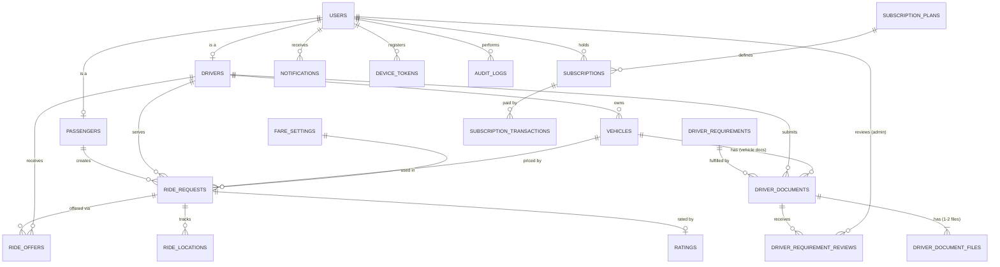

# Papaya HatidGo — Phase 0 System Analysis

> **Status:** Draft for review. Nothing here is implemented yet.
> **Scope:** Academic case study. Payments run in the gateway's **test mode** only, and all fares and prices are sample values.
> **Related:** `PRODUCT.md` (repository root) records product facts. This document records the system design.

**Contents**

- [0. Development protocol](#0-development-protocol)
- [A. Architecture](#a-architecture)
- [B. Mobile navigation](#b-mobile-navigation)
- [C. Database (initial ERD)](#c-database-initial-erd)
- [D. Driver requirements workflow](#d-driver-requirements-workflow)
- [E. Ride types and the ride lifecycle](#e-ride-types-and-the-ride-lifecycle)
- [F. Subscriptions and payment protocol](#f-subscriptions-and-payment-protocol)
- [G. API specification (initial)](#g-api-specification-initial)
- [H. SQLite strategy](#h-sqlite-strategy)
- [I. GPS and location](#i-gps-and-location)
- [J. Notification events](#j-notification-events)
- [K. Security controls](#k-security-controls)
- [L. Testing requirements](#l-testing-requirements)
- [M. Development phases](#m-development-phases)
- [N. Decisions log](#n-decisions-log)

---

## 0. Development protocol

Every feature goes through the same eight steps, in this order. The case study can present this as the project's methodology.

| Step | Output | Tool / artifact |
|---|---|---|
| 1. Requirement | User story + business rules | `docs/requirements.md` |
| 2. Flow | Screen flow + states (normal, empty, error, blocked) | `/impeccable shape <flow>` |
| 3. Data | Changes to the ERD (new tables or columns) | This document, section C |
| 4. Contract | API endpoint: purpose, role, request, validation, response, errors | Section G, then `docs/api.md` |
| 5. Backend | Migration → Model → Form Request → Policy → Service → Controller → Resource → **tests** | Laravel + PHPUnit/Postman |
| 6. Mobile logic | Angular service (API calls, state) | `core/services` or `features/*/services` |
| 7. Mobile UI | Page, then design refinement | `/impeccable critique` → `layout` → `harden` |
| 8. Verify | Device test + review, then commit | Test checklist (section L) |

**Rules of the protocol:**
- **Backend first, UI second.** Prove each business rule with Postman or PHPUnit before a screen depends on it.
- **The server decides; the app displays.** Eligibility, fares, ride status, and subscription status are always computed by Laravel.
- **Every rejection names the reason and the fix.** Example: "Expired na ang subscription mo → I-renew."

---

## A. Architecture

```text
┌──────────────────────────────────────┐      ┌──────────────────────────────┐
│ MOBILE APP (one APK, role-based)     │      │ ADMIN WEB (Angular)          │
│ Ionic + Angular + TypeScript         │      │ verification, fares, plans,  │
│  Pages ── UI only                    │      │ monitoring, reports, audit   │
│  Services ── API, state, rules-view  │      └──────────────┬───────────────┘
│  SQLite ── cache / settings / queue  │                     │
│  Capacitor ── GPS, camera, browser,  │                     │
│               network, push, secure  │                     │
│               storage                │                     │
└──────────────────┬───────────────────┘                     │
                   │ HTTPS · JSON · Bearer token (Sanctum)    │
                   ▼                                          ▼
┌──────────────────────────────────────────────────────────────────────────┐
│ LARAVEL REST API  (/api/v1)                                              │
│ Middleware: auth:sanctum · role · throttle                               │
│ Form Requests (validation) → Controllers (thin) → Policies (authorize)   │
│ Services:                                                                │
│  - Ride flow: RideService · DriverMatchingService · FareService          │
│  - Eligibility: DriverComplianceService · SubscriptionService            │
│  - Integrations: PaymentService · NotificationService · AuditService     │
│ API Resources (consistent JSON)                                          │
│ Scheduler: expire documents, expire subscriptions, expire stale rides    │
└───────┬───────────────────────┬──────────────────────┬───────────────────┘
        ▼                       ▼                      ▼
     MySQL              PayMongo (test mode)     Firebase Cloud Messaging
  (source of truth)     via PaymentService       via NotificationService
                        + signed webhooks
```

| Layer | Owns | Never does |
|---|---|---|
| Pages | Rendering, user input | HTTP calls, business rules |
| Angular services | API calls, app state, plugin wrappers | Decide status, fare, or eligibility |
| Capacitor | Native bridge | Logic |
| SQLite | Offline cache, preferences, retry queue | Act as the source of truth |
| Laravel services | Every business rule | Trust client-sent fares, statuses, or payment results |
| MySQL | Authoritative data | — |
| Payment gateway | Collecting money (test mode) | Get called from the mobile app directly |

**Key technical decisions (recommended):**

1. **Sanctum API tokens.**
   The app stores its token in Keystore-backed secure storage and sends `Authorization: Bearer …` with every request.
2. **Live ride updates in v1 use polling.**
   - During an active ride, the app polls `GET /rides/{id}` every 3–5 seconds.
   - An online driver polls `GET /drivers/me/offers` every 5 seconds.
   - FCM push adds background alerts on top.
   - Polling is simple, testable, and easy to defend. WebSockets can come later behind `RideService`.
3. **Laravel Scheduler (cron) handles time-based rules.**
   Document expiry, subscription expiry, and ride requests nobody accepted are all processed on a schedule. The same checks also run at the moment a user action depends on them, so the system stays correct even between scheduled runs.

---

## B. Mobile navigation

```text
App start → token? ─no→ /welcome → /auth/login · /auth/register (Pasahero | Driver) · /auth/forgot-password
            │
            yes → GET /auth/me → role → resume active ride if one exists
            │
            ├── PASSENGER (tabs)
            │   ├── Book (home)
            │   │     gate: subscription active? ─no→ "Subscribe to book" card → /account/subscription
            │   │     /passenger/book              current location + pickup pin
            │   │     /passenger/book/destination  choose destination
            │   │     /passenger/book/type         ○ One-way  ○ Two-way (round trip)
            │   │     /passenger/book/confirm      fare breakdown → "Mag-book"
            │   │     /passenger/ride/:id          ACTIVE RIDE (one screen, content changes per status/leg)
            │   │         searching → accepted → driver_arriving → arrived → in_progress
            │   │         [two-way: outbound → waiting → return] → completed → rate
            │   ├── Rides     /passenger/rides, /passenger/rides/:id (details + receipt)
            │   ├── Alerts    /notifications
            │   └── Account   profile · change password · subscription (plans, history) · settings · help
            │
            └── DRIVER (tabs)
                ├── Home  /driver/home
                │     ELIGIBILITY CHECKLIST (from GET /drivers/me/eligibility):
                │       ✓/✗ Verified  ✓/✗ Documents valid  ✓/✗ Vehicle verified  ✓/✗ Subscription active
                │     all ✓ → Online/Offline toggle → incoming offer (accept / decline)
                │     /driver/ride/:id   ACTIVE RIDE
                │         papunta → nandito na → sakay na → [two-way: nasa destinasyon → naghihintay → pabalik] → tapos
                ├── Rides     /driver/rides, /driver/rides/:id
                ├── Earnings  /driver/earnings (day / week / month)
                └── Account   profile · requirements (list, upload, status, resubmit) · vehicle ·
                              subscription · change password · settings · help
```

**Guards and gates:**

| Guard | Purpose | Enforced by server too? |
|---|---|---|
| `authGuard` | Must be logged in | Yes (`auth:sanctum`) |
| `roleGuard` | PASSENGER or DRIVER area | Yes (role middleware + policies) |
| Resume on start | `GET /rides/active`: if a ride exists, jump to it | n/a |
| Passenger booking gate | UI hint only | Yes: `POST /rides` rejects without an active subscription |
| Driver eligibility checklist | UI hint only | Yes: `PATCH /drivers/me/availability` rejects when not eligible |

**Design note:** a blocked state is a screen with a way forward. Never show a dead end.

---

## C. Database (initial ERD)

### C.1 Entity–relationship diagram



### C.2 Tables — MVP

Notation:
- **PK** = primary key, **FK** = foreign key, **UQ** = unique.
- Money is stored as `DECIMAL(10,2)`, never FLOAT.
- Coordinates are stored as `DECIMAL(10,7)`.

**Identity**

| Table | Columns | Notes |
|---|---|---|
| `users` | id PK, name, email UQ, phone UQ, password, role enum(passenger, driver, admin), account_status enum(active, suspended), email_verified_at, timestamps | One login table for every role. Login works with email **or** phone. Email is required for password reset. |
| `passengers` | id PK, user_id FK **UQ**, emergency_contact_name, emergency_contact_phone (nullable, for future SOS), timestamps | 1:1 with users |
| `drivers` | id PK, user_id FK UQ, license_number UQ, compliance_status enum(pending_verification, under_review, verified, rejected, suspended, expired), is_online bool, current_lat, current_lng, location_updated_at, timestamps | Index on (compliance_status, is_online) for matching |
| `vehicles` | id PK, driver_id FK, plate_number UQ, body_number, make, model, color, status enum(pending, verified, rejected, inactive), is_primary bool, timestamps | The primary vehicle is the one used for rides |

**Driver compliance** (details in section D)

| Table | Columns | Notes |
|---|---|---|
| `driver_requirements` | id PK, name, description, applies_to enum(driver, vehicle), accepted_file_types, is_required, is_critical, requires_expiry, is_active, sort_order, timestamps | **Configured by the admin**, e.g. "Driver's License", "OR/CR", "Franchise/Permit" |
| `driver_documents` | id PK, driver_id FK, driver_requirement_id FK, vehicle_id FK null, document_number, issued_at, expires_at null, status enum(pending, approved, rejected, expired, resubmission_required), is_current bool, submitted_at, reviewed_at, reviewed_by FK→users null, timestamps | A resubmission creates a **new row**, so history is preserved. `is_current` flips **on approval** when replacing an approved, unexpired document (renewal without going offline); otherwise on upload. (driver-requirements brief) |
| `driver_document_files` | id PK, driver_document_id FK, file_path (private disk), original_filename, mime_type, file_size, side enum(front, back, page) null, sort_order, created_at | 1–2 files per document (e.g. license front + back). Split out of `driver_documents` (one document, many files). |
| `driver_requirement_reviews` | id PK, driver_document_id FK, admin_id FK→users, action enum(approved, rejected, resubmission_requested, expired_by_system), reason, created_at | Permanent review history |

**Rides** (details in section E)

| Table | Columns | Notes |
|---|---|---|
| `fare_settings` | id PK, base_fare, rate_per_km, minimum_fare, return_rate_multiplier (default 1.00), waiting_free_minutes (default 0), waiting_fee_per_minute (default 0.00), service_fee (default 0.00), is_active, effective_from, created_by FK→users, timestamps | **Versioned and never edited.** A fare change inserts a new row, so old rides always reference the exact rates they were charged at. |
| `ride_requests` | See E.4 | The core table |
| `ride_offers` | id PK, ride_request_id FK, driver_id FK, status enum(offered, accepted, declined, expired, withdrawn), offered_at, responded_at, UQ(ride_request_id, driver_id) | Records who received the request and who declined |
| `ride_locations` | id PK, ride_request_id FK, lat, lng, accuracy_m, recorded_at | The driver's route during a ride |
| `ratings` | id PK, ride_request_id FK **UQ**, passenger_id FK, driver_id FK, score tinyint (1–5, CHECK constraint), comment, created_at | One rating per ride |

**Subscriptions and payments** (details in section F)

| Table | Columns | Notes |
|---|---|---|
| `subscription_plans` | id PK, code UQ, name, user_type enum(passenger, driver), price, currency default 'PHP', duration_months (int: 1, 6, 12 to start), benefits (text, display only), is_active, sort_order, timestamps | Configured by the admin. Sample prices only. |
| `subscriptions` | id PK, user_id FK, subscription_plan_id FK, status enum(pending, active, past_due, expired, cancelled, suspended), amount (price snapshot), starts_at null, ends_at null, cancelled_at, timestamps | **One row per paid period.** A renewal creates a new row. |
| `subscription_transactions` | id PK, subscription_id FK, user_id FK, amount, currency, status enum(pending, paid, failed, expired, refunded), provider ('paymongo'), provider_checkout_id UQ, provider_payment_id null, payment_method null, paid_at null, failure_reason null, timestamps | One row per checkout attempt |
| `payment_events` | id PK, provider, provider_event_id **UQ**, event_type, payload JSON, processed_at null, created_at | Webhook log. The unique column is what makes webhook processing **idempotent**. |

**Platform**

| Table | Columns | Notes |
|---|---|---|
| `notifications` | Laravel's built-in table: id uuid, type, notifiable_type, notifiable_id, data JSON, read_at, timestamps | In-app notification list |
| `device_tokens` | id PK, user_id FK, token UQ, platform, last_used_at, timestamps | FCM targets |
| `audit_logs` | id PK, actor_id FK→users null, action, target_type, target_id, old_values JSON, new_values JSON, ip_address, created_at | Append-only |
| `system_settings` | id PK, key UQ, value, type, updated_by, timestamps | Examples: `ride.one_way_enabled`, `ride.two_way_enabled`, `matching.radius_km`, `matching.request_timeout_seconds`, `subscription.grace_days`, `service_area.center_lat/lng/radius_km` |
| `personal_access_tokens` | Created by Sanctum | Login tokens |

### C.3 Tables — later phases

These are designed now but migrated later:
- `complaints`: id, reporter_id, ride_request_id null, against_user_id null, category, description, status, resolved_by, resolved_at.
- `support_tickets`: id, user_id, subject, message, status, assigned_to.
- `messages`: for in-app chat.

### C.4 Design decisions to explain in the defense

1. **Driver earnings have no table.** Earnings are *derived* data, `SUM(final_total)` over completed rides grouped by day, week, or month. Storing them would create a second copy that could disagree with the rides.
2. **Versioned `fare_settings` rather than copying rates into each ride.** Nothing is duplicated, and history stays correct.
3. **Timestamps rather than booleans.** For example, `return_started_at` instead of `return_started = true`. A timestamp answers both "did it happen?" and "when?". It also can't contradict itself the way a pair like `return_started = false` + `return_completed = true` can.
4. **Resubmission = new document row.** An approval or rejection is never overwritten, which gives full audit history.
5. **One subscription row per paid period.** Payment history and renewal history are then simply the list of rows.
6. **Rules the database cannot express,** enforced in services inside transactions:
   - one active ride per passenger;
   - one active ride per driver;
   - one current document per (driver, requirement, vehicle);
   - one active or pending subscription per user and period.

---

## D. Driver requirements workflow

### D.1 Document states

```text
            upload
   (none) ─────────► pending ──approve──► approved ──expires_at passes──► expired
                        │                    ▲                                │
                        ├──reject──► rejected│                                │
                        │               │    │                                │
                        └─request fix─► resubmission_required                 │
                                        │    │                                │
                                        └────┴─── driver uploads new file ◄───┘
                                               (new row: pending; old row stays current until the new one is approved if it was approved + unexpired)
```

### D.2 Driver compliance status

The status is derived by `DriverComplianceService::recalculate($driver)`. It runs every time a document or vehicle changes, and in the daily scheduler. The **first matching rule wins**:

| # | Condition | Status | What the app shows |
|---|---|---|---|
| 1 | Admin suspended the driver | `suspended` | "Suspended ang account. Makipag-ugnayan sa admin." |
| 2 | A **critical** required document is expired | `expired` | Which document expired, plus an upload button |
| 3 | A required document is rejected or needs resubmission | `rejected` | The rejection reason, plus a resubmit button |
| 4 | A required document is missing | `pending_verification` | A checklist of what still needs uploading |
| 5 | All required documents submitted, at least one pending | `under_review` | "Sinusuri ng admin" |
| 6 | All required documents approved and not expired, primary vehicle verified | `verified` | Eligible for the next check (subscription) |

### D.3 Go-online eligibility

`DriverComplianceService::eligibility($driver)` returns a checklist, which the app displays as-is:

```json
{
  "eligible": false,
  "checks": [
    { "key": "account_active",       "passed": true },
    { "key": "compliance_verified",  "passed": true },
    { "key": "vehicle_verified",     "passed": true },
    { "key": "subscription_active",  "passed": false, "action": "renew_subscription" }
  ]
}
```

**Side effect:** if a driver who is currently online becomes ineligible, the scheduler sets them offline and notifies them.

### D.4 Admin review

The admin can:
- approve, reject (reason required), or request resubmission (reason required) for each document;
- suspend or reactivate the driver.

Each action writes one `driver_requirement_reviews` row (for document actions), one `audit_logs` row, and sends a notification to the driver.

### D.5 Document handling

- **Allowed files:** JPG, PNG, or PDF, 5 MB maximum. Laravel validates the MIME type server-side.
- **Storage:** Laravel's **private** disk (`storage/app/private/…`), never `public/`.
- **Viewing:** admins open files only through an authorized endpoint that streams the file. There are no public URLs.
- **Capture on the phone:** Capacitor Camera (take a photo or pick from the gallery), or a file input for PDFs.

---

## E. Ride types and the ride lifecycle

### E.1 Types

| Type | Route | Fare |
|---|---|---|
| `one_way` | pickup → destination | `max(minimum_fare, base_fare + outbound_km × rate_per_km)` + service_fee |
| `two_way` | pickup → destination → *(wait)* → back to pickup | outbound_fare + return_fare + waiting_fee + service_fee |

**Two-way fare details:**
- `return_fare = return_km × rate_per_km × return_rate_multiplier`. There is no second base fare by default. **Open decision:** the multiplier's default value.
- `waiting_fee = max(0, waiting_minutes − waiting_free_minutes) × waiting_fee_per_minute`. It **defaults to ₱0** because the waiting-fee rule is still an open decision.
- In the estimate, `return_km = outbound_km`. The final fare uses the same value in v1.
- The admin can enable or disable each ride type (`system_settings`).

### E.2 Status + leg

The **status stays the same seven values**. A two-way ride adds a sub-state, `current_leg`, only while its status is `in_progress`:

```text
requested ─► accepted ─► driver_arriving ─► arrived ─► in_progress ─────────────────► completed
    │            │              │              │        one_way: current_leg = null
    └────────────┴──────────────┴──────────────┴──► cancelled
                                                        two_way: current_leg
                                                        outbound ─► waiting ─► return ─► completed
```

### E.3 Allowed transitions

These are enforced by `RideService`, and each one has its own endpoint.

| Action (endpoint) | From | To | Who | Records |
|---|---|---|---|---|
| create | — | requested | passenger | requested_at, expires_at |
| accept | requested | accepted | offered driver (first wins) | driver_id, vehicle_id, accepted_at |
| depart | accepted | driver_arriving | assigned driver | arriving_at |
| arrive | driver_arriving | arrived | assigned driver | arrived_at |
| start | arrived | in_progress (leg: outbound if two_way) | assigned driver | started_at |
| reach-destination | in_progress + two_way + outbound | leg: waiting | assigned driver | destination_reached_at |
| start-return | in_progress + two_way + waiting | leg: return | assigned driver | return_started_at, waiting_minutes |
| complete | in_progress (one_way, or two_way + return) | completed | assigned driver | completed_at, final_total |
| end-at-destination *(proposed)* | in_progress + two_way + waiting | completed | assigned driver, with reason | Final fare = outbound + waiting fee. Covers a passenger who doesn't come back. |
| cancel | requested / accepted / driver_arriving / arrived | cancelled | passenger, or assigned driver (reason required) | cancelled_at, cancelled_by, cancel_reason |
| expire | requested (no acceptance before expires_at) | cancelled | system | cancelled_by = system, reason = no_driver |

**Every other combination returns `409 Conflict`,** with a message that names the current status.

**Proposed cancellation rules** (an open decision):
- There is no cancel once the status is `in_progress`.
- A driver may cancel at `arrived` only after N minutes without the passenger showing up.

### E.4 `ride_requests` columns

```text
id PK · reference_no UQ (e.g. HG-000123, for receipts)
passenger_id FK · driver_id FK null · vehicle_id FK null · fare_setting_id FK
ride_type enum(one_way, two_way) · status enum(7) · current_leg enum(outbound, waiting, return) null
pickup_lat · pickup_lng · pickup_address
destination_lat · destination_lng · destination_address
outbound_distance_km · return_distance_km null
outbound_fare · return_fare null · waiting_minutes null · waiting_fee (0) · service_fee (0)
estimated_total · final_total null
passenger_note null
requested_at · expires_at · accepted_at · arriving_at · arrived_at · started_at
destination_reached_at null · return_started_at null · completed_at null
cancelled_at null · cancelled_by enum(passenger, driver, system, admin) null · cancel_reason null
timestamps
```

### E.5 Matching protocol (v1: nearby broadcast)

1. The passenger submits a ride request. Before creating it, the server checks:
   - the account is active;
   - the subscription is active;
   - the passenger has no other active ride;
   - the ride type is enabled;
   - pickup and destination are inside the service area.
2. The server calculates the fare and creates the ride with `status = requested` and `expires_at = now + request_timeout` (e.g. 120 s).
3. `DriverMatchingService` selects up to *N* eligible drivers (e.g. 5), nearest first by Haversine distance, within `matching.radius_km`. Eligible means:
   - online **and** `location_updated_at` within the last 3 minutes (the scheduler sets stale drivers offline, so a driver whose phone died or lost signal never receives requests they will miss);
   - compliance status `verified`;
   - primary vehicle verified;
   - subscription active;
   - no active ride.
4. The service creates a `ride_offers` row for each selected driver. The drivers see the offer through polling or push.
5. **The first driver to accept wins.** Inside a DB transaction:
   ```sql
   UPDATE ride_requests
   SET status='accepted', driver_id=?
   WHERE id=? AND status='requested'
   ```
   If this updates 0 rows, the ride was already taken and that driver gets `409 Conflict`. The other offers become `withdrawn`.
6. **A decline** marks that driver's offer `declined`. The service may then offer the ride to the next nearest eligible driver.
7. **If nobody accepts before `expires_at`,** the ride is cancelled with `cancelled_by = system` and the passenger sees "Walang available na driver. Subukan ulit." This is checked on every poll and by the scheduler.

Broadcasting to a few nearby drivers is simpler and faster than offering to one driver at a time, and it suits a small town.

---

## F. Subscriptions and payment protocol

### F.1 Rules

| Rule | Passenger | Driver |
|---|---|---|
| Required for | **Booking a ride** | **Going online** |
| Without a subscription, can still | Register, log in, edit profile, view history, subscribe | Register, log in, upload requirements, view history, subscribe |
| Plans | `user_type = passenger` | `user_type = driver` |
| Plan lengths | 1 / 6 / 12 months (admin can add others via `duration_months`) | Same |
| Renewal | Manual. There is no stored card and no auto-charge. | Same |

**Status meanings:**

| Status | Meaning |
|---|---|
| `pending` | Checkout created, not paid yet |
| `active` | Paid, and `starts_at ≤ now < ends_at` |
| `past_due` | Ended, but within the grace period (`subscription.grace_days`, default 0). **Open decision:** whether passengers and drivers still count as active in this window. |
| `expired` | Ended, and past the grace period |
| `cancelled` | The user cancelled a pending checkout, or cancelled before the period started |
| `suspended` | Admin action |

**Renewal timing:**
- If the current subscription is still active, the new period **starts at the current `ends_at`**, so no paid days are lost.
- If it has expired, the new period starts at the moment of payment.

`SubscriptionService` (Laravel) owns `isActive($user)`, `current($user)`, `remainingDays($user)`, and `activate($transaction)`. Nothing else decides subscription status.

### F.2 Payment protocol (PayMongo Checkout, test mode)

```text
 MOBILE APP                    LARAVEL                              PAYMONGO (test)
     │ POST /subscriptions        │                                      │
     │ {plan_id} ────────────────►│ validate plan.user_type == role      │
     │                            │ create subscription (pending)        │
     │                            │ create transaction (pending)         │
     │                            │ PaymentService.createCheckout() ────►│ create checkout session
     │                            │◄──────────── checkout_url, id ───────│
     │◄── { checkout_url } ───────│ save provider_checkout_id            │
     │ open in-app browser ──────────────────────────────────────────────►│ user pays (test GCash/card)
     │                            │◄──── webhook: checkout paid ─────────│
     │                            │ 1 verify signature (webhook secret)  │
     │                            │ 2 store payment_events (UQ event id) │
     │                            │   → duplicate? return 200 and stop   │
     │                            │ 3 check amount == transaction.amount │
     │                            │ 4 DB transaction:                    │
     │                            │   transaction → paid                 │
     │                            │   subscription → active + dates      │
     │                            │ 5 notify user                        │
     │                            │ 6 respond 200 ──────────────────────►│
     │ browser closed             │                                      │
     │ GET /subscriptions/current ►│ (if still pending: PaymentService    │
     │  (poll ~3× over 10 s)      │  .fetchCheckout() to reconcile) ────►│
     │◄── status: active ─────────│                                      │
```

**Protocol guarantees:**

1. **The app never reports payment success.** The redirect back to the app only triggers a status check.
2. **The webhook is idempotent.** If PayMongo sends the same event twice, `payment_events.provider_event_id UQ` blocks the second one.
3. **The amount is verified server-side.** A tampered checkout amount is never accepted.
4. **Secret keys exist only in the Laravel `.env`.** The app never holds a gateway key.
5. **Reconciliation.** If the webhook is late, Laravel asks the gateway directly for the checkout status.
6. **Demo fallback.** An admin can manually activate a subscription (written to the audit log) if the gateway is unreachable during a demo.

**Local development:** the gateway can't reach `localhost`. Webhooks during development need a tunnel (ngrok or cloudflared). Reconciliation (#5) also covers this.

---

## G. API specification (initial)

**Conventions:**
- Base path `/api/v1`, JSON only.
- Authentication: `auth:sanctum` unless marked public.
- Error format: `{ "message": "...", "errors": { field: [...] }, "code": "SUBSCRIPTION_INACTIVE" }`.
- Status codes: 401 unauthenticated · 403 wrong role or not owner · 404 · 409 invalid state transition · 422 validation · 429 rate limit.

### Auth
| Method | Endpoint | Role | Purpose |
|---|---|---|---|
| POST | /auth/register | public | Create a passenger or driver account (plus passengers/drivers row) |
| POST | /auth/login | public (throttled) | Email or phone + password → token |
| POST | /auth/logout | any | Revoke the current token |
| GET | /auth/me | any | User, role, and summary (subscription status; compliance status for drivers) |
| POST | /auth/forgot-password | public (throttled) | Send a reset link by email |
| POST | /auth/reset-password | public | Reset using the token |
| PUT | /auth/password | any | Change password (current password required) |

### Profiles, drivers, vehicles, requirements
| Method | Endpoint | Role | Purpose |
|---|---|---|---|
| GET / PATCH | /passengers/me | passenger | Profile |
| GET / PATCH | /drivers/me | driver | Profile |
| GET | /drivers/me/eligibility | driver | Go-online checklist (D.3) |
| PATCH | /drivers/me/availability | driver | `{is_online}`. Rejected with 403 + checklist if not eligible. |
| POST | /drivers/me/location | driver (online) | `{lat, lng, accuracy}` (throttled) |
| GET | /driver-requirements | driver | Active requirement definitions |
| GET | /drivers/me/requirements | driver | Each requirement with its current document status |
| POST | /drivers/me/documents | driver | Multipart upload `{requirement_id, vehicle_id?, files[] (1–2, each with side), document_number?, expires_at?}` |
| GET | /drivers/me/documents/{id} | driver (owner) | Status + review history |
| GET / POST | /vehicles | driver | List / register own vehicles |
| PATCH | /vehicles/{id} | driver (owner) | Update. Changing the plate resets status to pending. |
| GET | /drivers/me/earnings?period=day\|week\|month | driver | Totals derived from completed rides |

### Fares and rides
| Method | Endpoint | Role | Purpose |
|---|---|---|---|
| GET | /ride-types | any | Which types are enabled |
| POST | /fare/estimate | passenger | `{ride_type, pickup, destination}` → breakdown |
| POST | /rides | passenger | Create a request. **Server recomputes the fare.** Checks the booking gate (E.5 step 1). |
| GET | /rides/active | any | The current active ride, if any (used for resume) |
| GET | /rides | any | Own history (paginated) |
| GET | /rides/{id} | participant / admin | Details, status, leg, driver location, receipt data (the polling target) |
| GET | /drivers/me/offers | driver | Open offers |
| POST | /rides/{id}/accept | offered driver | Race-safe accept |
| POST | /rides/{id}/decline | offered driver | Decline |
| POST | /rides/{id}/depart · /arrive · /start | assigned driver | Transitions (E.3) |
| POST | /rides/{id}/reach-destination · /start-return | assigned driver | Two-way legs |
| POST | /rides/{id}/complete | assigned driver | Complete + final fare |
| POST | /rides/{id}/cancel | participant | `{reason}` |
| POST | /rides/{id}/locations | assigned driver | Route trail |
| POST | /rides/{id}/rating | passenger (owner, completed) | `{score, comment}`, once |
| POST | /rides/{id}/passenger-returning | passenger (owner), Balikan in the waiting leg | Notifies the driver "Pabalik na ang pasahero". **Changes no status.** Max once per 5 min. (active-ride brief) |

### Subscriptions and payments
| Method | Endpoint | Role | Purpose |
|---|---|---|---|
| GET | /subscription-plans | any | Active plans for the caller's role |
| GET | /subscriptions/current | any | Status, plan, ends_at, remaining days |
| GET | /subscriptions | any | History |
| POST | /subscriptions | any | `{plan_id}` → pending subscription + `checkout_url` |
| POST | /subscriptions/{id}/renew | owner | New period + `checkout_url` |
| GET | /subscription-transactions | any | Own payment history |
| POST | /webhooks/paymongo | **public, signature-verified** | Gateway callback (F.2) |

### Notifications
| Method | Endpoint | Role | Purpose |
|---|---|---|---|
| GET | /notifications | any | List (paginated) |
| PATCH | /notifications/{id}/read · POST /notifications/read-all | any | Mark as read |
| POST / DELETE | /device-tokens | any | Register or remove an FCM token |

### Admin (`/api/v1/admin/*`, role = admin; every write is audit-logged)
- **Dashboard:** `GET /dashboard`
- **Users:** `GET /users`, `PATCH /users/{id}/status`
- **Driver verification:**
  - `GET /driver-verifications?status=`
  - `GET /driver-documents/{id}`, `GET /driver-documents/{id}/file` (streams the file)
  - `POST /driver-documents/{id}/approve | reject | request-resubmission`
  - `POST /drivers/{id}/suspend | reactivate`
- **Vehicles:** `PATCH /vehicles/{id}/status`
- **Requirements:** `GET/POST/PATCH /driver-requirements`
- **Rides:** `GET /rides?status=&type=`, `POST /rides/{id}/cancel`
- **Fares and settings:** `GET/POST /fare-settings` (insert-only), `GET/PATCH /system-settings`
- **Subscriptions:** `GET/POST/PATCH /subscription-plans`, `GET /subscriptions`, `GET /subscription-transactions`, `POST /subscriptions/{id}/activate` (manual fallback)
- **Reports and logs:** `GET /reports/{rides|revenue|drivers}`, `GET /audit-logs`

Each endpoint gets a full contract (validation, responses, errors, security) in `docs/api.md` when it is built.

---

## H. SQLite strategy

**Test for putting data in SQLite:** is it useful offline or at startup, **and** is it safe if it's stale, **and** is it not sensitive?

| Local table | Contents | Why |
|---|---|---|
| `local_user` | id, name, role, phone, last_synced_at | The right home screen appears instantly; it is refreshed from `/auth/me` |
| `app_settings` | language, onboarding_seen, last_map_center, notification preferences | Device preferences |
| `cached_rides` | **Completed or cancelled** rides only (summary + receipt fields) | History and receipts offline. Finished rides never change. |
| `cached_status` | Subscription status/ends_at, compliance status, `active_ride_id` + last_synced_at | Display and resume hints only, labeled "last updated". Never used to allow an action. |
| `pending_sync` | id, action, payload JSON, attempts, created_at | Retry queue for **safe, idempotent** actions only: rating, profile edit |

| Never stored in SQLite | Why |
|---|---|
| Auth token | Goes in secure storage (Android Keystore) |
| Passwords, payment data, checkout URLs | Sensitive |
| Driver document files | Sensitive; uploaded, then removed from the device |
| Ride create / accept / transitions in `pending_sync` | Must be live. A ride action sent late is wrong. When offline, show "Walang internet". |
| Other users' data or live locations | Privacy, and no offline use |

**Plugin:** `@capacitor-community/sqlite`. The app accesses it only through `SQLiteService`, and the local schema is versioned from the start.

**Other plugin added by the driver-home brief:** `@capacitor-community/keep-awake`, active only while a driver is online (Phase 11), so the screen stays on and requests keep arriving until push notifications exist.

---

## I. GPS and location

```text
Android (GPS + network location · FINE/COARSE permission)
  → Capacitor Geolocation (checkPermissions · requestPermissions · getCurrentPosition · watchPosition)
    → LocationService (Angular): one place for permissions, errors (DENIED | GPS_OFF | TIMEOUT), throttling
      → MapService: pins, driver marker, route line, distance display (provider-agnostic)
      → RideService / DriverService: send coordinates to the API
        → Laravel: validates range + service area, authorizes sender, Haversine matching
          → MySQL: drivers.current_lat/lng · ride_requests pickup/destination · ride_locations
```

**Send only when needed:**

| Situation | Who sends | How often |
|---|---|---|
| Choosing pickup | Passenger | Once (`getCurrentPosition`). The pin is then draggable. |
| Driver online, idle | Driver | Every 60 s, or after moving 100 m (enough for matching) |
| Driver on an active ride | Driver | Every 10 s → `ride_locations` + current position |
| Driver offline / passenger idle | Nobody | Never |

**Other rules:**
- **The server computes all distances** with Haversine in v1. Road-routing distance can replace it later behind `MapService.calculateRoute()` and `FareService`.
- **Map (recommended):** Leaflet + OpenStreetMap. It needs no API key or billing and sits behind `MapService`.
- **Service area (until the exact town is confirmed):** a circle defined by `service_area.center` + `radius_km` in `system_settings`.
- **Permission flow:** explain why location is needed → request the permission → if denied, show how to enable it in Settings. On Android 12+, a user can grant "approximate" location only; the app then warns about accuracy.
- **Background location is not used.** Drivers keep the app open while on duty.

---

## J. Notification events

**Delivery channels:**
- **In-app:** a row in the `notifications` table, always.
- **Push:** FCM, for time-sensitive events.
- **The ride flow never *depends* on push.** Polling is the backbone.

| # | Event | Recipient | Push? | Trigger |
|---|---|---|---|---|
| 1 | New ride offer | Driver(s) | ✓ | `ride_offers` created |
| 2 | Driver accepted | Passenger | ✓ | accept |
| 3 | Driver on the way / arrived | Passenger | ✓ | depart / arrive |
| 4 | Ride started · return trip started | Passenger | – (screen updates) | start / start-return |
| 5 | Ride completed (with receipt) | Passenger + driver | ✓ | complete |
| 6 | Ride cancelled | The other party | ✓ | cancel |
| 7 | No driver found | Passenger | ✓ | system expiry |
| 8 | Document approved / rejected / resubmission requested | Driver | ✓ | admin review |
| 9 | Document expiring in 30 days · 7 days · expired | Driver | ✓ | daily scheduler |
| 10 | Forced offline (became ineligible) | Driver | ✓ | scheduler |
| 11 | Subscription activated | User | ✓ | webhook |
| 12 | Subscription expiring in 3 days · expired | User | ✓ | daily scheduler |
| 13 | Payment failed / checkout expired | User | – | webhook / scheduler |
| 14 | New driver registration · new document submitted | Admin | – (dashboard badge) | upload |
| 15 | Payment or webhook error | Admin | – | PaymentService |
| 16 | Passenger coming back (Balikan waiting leg) | Driver | ✓ | passenger-returning endpoint (active-ride brief) |

**Android 13+ note:** push notifications need the `POST_NOTIFICATIONS` runtime permission, requested with an explanation.

---

## K. Security controls

| Area | Control |
|---|---|
| Passwords | Hashed (bcrypt or argon2 via Laravel). Minimum length rule. Throttled login and reset. |
| Tokens | Sanctum tokens with an expiry. Revoked on logout. Stored in Keystore-backed secure storage. A 401 interceptor logs the user out. |
| Authorization | Role middleware on every route group, plus **Policies** per resource (ride participant, document owner, admin). The frontend guards are UX only. |
| Validation | Form Requests on every write: coordinate ranges, enums, file type/size, plan belongs to the caller's role |
| Mass assignment | Explicit `$fillable`. Clients can never set status, fare, role, compliance, or subscription fields. |
| IDOR | Every `{id}` lookup is scoped to the owner or a participant (a 404 or 403 otherwise) |
| Business integrity | Server-side fares. State-machine transitions. Race-safe accept. Eligibility checked at the moment of the action. |
| Payments | Webhook signature verification · idempotent events · server-side amount check · gateway keys only in `.env` · test mode only |
| Documents | Private disk · MIME validation · 5 MB limit · randomized file names · admin-only streaming endpoint · no public URLs |
| Privacy | Phone numbers are visible only between the matched passenger and driver during an active ride. Location trails are visible only to participants and admins. |
| Transport | HTTPS in production. A development-only cleartext exception limited to the dev host. |
| Rate limiting | Login, reset, register, location updates, fare estimate |
| Audit | Every admin write, plus system actions on compliance and subscriptions → `audit_logs` (append-only) |
| Secrets | `.env`, keystore, and `google-services.json` excluded from git from the first commit |

**Threats checklist (for the case study):**
1. A passenger edits the fare → the server recomputes it.
2. Two drivers accept at once → conditional update inside a transaction.
3. A passenger opens someone else's ride → policy returns 403 or 404.
4. A forged "payment paid" request → signature check fails and the request is ignored.
5. The same webhook is replayed → the unique event id makes it a no-op.
6. A driver goes online without a subscription → rejected by the availability endpoint.
7. Someone guesses a document URL → no public URL exists.

---

## L. Testing requirements

| Level | Tool | What |
|---|---|---|
| Backend unit | PHPUnit | FareService (one-way, two-way, minimum fare, waiting fee = 0), compliance status rules (D.2 table), subscription date math (renew-while-active vs renew-after-expiry) |
| Backend feature/API | PHPUnit + Postman collection | Auth, role access, **every valid and invalid ride transition**, race-safe accept, booking gate, go-online gate, document upload validation, webhook signature + idempotency, admin audit logging |
| Mobile unit | Vitest (already configured) | Guards, services (response mapping, error states), LocationService error mapping |
| Device (manual) | Emulator + physical phone | GPS granted, denied, and approximate · offline and reconnect · camera upload · in-app browser payment in test mode · push |
| End to end | **Two devices** (passenger phone + driver emulator) | Full one-way ride · full two-way ride · cancellation at each allowed stage · no-driver expiry · rating |
| Acceptance (UAT) | Scenario scripts for the panel demo | See below |

**Sample test cases (use this format in `docs/test-cases.md`):**

| ID | Scenario | Steps | Expected |
|---|---|---|---|
| RIDE-01 | One-way happy path | Book → driver accepts → depart → arrive → start → complete → rate | Status sequence correct. Final fare = estimate. Rating saved. |
| RIDE-05 | Invalid transition | Driver calls `/complete` while `arrived` | 409 Conflict, status unchanged |
| RIDE-08 | Two-way legs | … start → reach-destination → start-return → complete | Legs recorded. waiting_minutes computed. Total = outbound + return + waiting. |
| MATCH-02 | Double accept | Two drivers accept the same ride at the same time | Exactly one succeeds; the other gets 409 |
| SUB-03 | Booking without a subscription | Passenger with an expired subscription taps "Mag-book" | 403 `SUBSCRIPTION_INACTIVE`. App shows the renew path. |
| PAY-02 | Duplicate webhook | Replay the same paid event | Subscription activated once. Second call returns 200 with no change. |
| COMP-04 | Critical document expires | Set expires_at in the past → run scheduler | Status becomes `expired`. Driver forced offline and notified. |
| SEC-03 | IDOR | Passenger A requests ride of passenger B | 403/404 |

---

## M. Development phases

| # | Phase | Done when… |
|---|---|---|
| 0 | Requirements, architecture, ERD, API, test plan (**this document**) | Reviewed and decisions confirmed |
| 1 | Mobile setup: Capacitor + Android platform (git + GitHub already done) | Blank app runs in the browser, emulator, and phone |
| 2 | Mobile architecture: core/shared/features, routing, guards, interceptors, environments | Empty passenger and driver areas reachable |
| 3 | Capacitor native proof: geolocation, network, app lifecycle | Real coordinates on the phone; denied permission handled |
| 4 | Laravel + MySQL: migrations and seeders for section C | ERD tables created; sample fares, plans, requirements seeded |
| 5 | Auth end to end (Sanctum, secure storage, role routing, password reset) | Login on the phone; roles route correctly; 401 handled |
| 6 | SQLite (`local_user`, `app_settings`) | CRUD tested on the device |
| 7 | Driver requirements + vehicles (backend + mobile). Approvals done through the admin API in Postman until the admin web exists. | Upload → review → verified works; status rules tested |
| 8 | Subscriptions + PayMongo test checkout + webhook | Pay in test mode → active; gates enforced |
| 9 | Ride state machine + matching (backend, fully tested) | RIDE / MATCH tests pass in Postman or PHPUnit |
| 10 | Passenger ride screens (one-way, then two-way) | A ride can be requested, tracked, cancelled, rated |
| 11 | Driver ride screens + earnings | Full ride on two devices |
| 12 | Maps (Leaflet) + live driver marker | Pins, route, and driver position visible |
| 13 | Notifications (in-app + FCM) | Events in section J delivered |
| 14 | Admin web dashboard | Verification, fares, plans, monitoring, reports, audit |
| 15 | Full testing + case study documentation | Section L checklist passes on a physical device |

**Why this order differs from the brief:**
- **Requirements and subscriptions come before ride screens (phases 7–8),** because they are *gates*: a ride cannot be tested unless an eligible driver and a subscribed passenger exist.
- **SQLite comes after Auth,** because `local_user` is filled from the login response.
- **The ride state machine is proven on the backend before any screen depends on it.**

---

## N. Decisions log

| # | Decision | Status |
|---|---|---|
| 1 | One role-based mobile app | ✅ Confirmed |
| 2 | Subscriptions required: passengers to book, drivers to go online | ✅ Confirmed |
| 3 | Online subscription payment in MVP, **test mode** | ✅ Confirmed |
| 4 | Gateway: **PayMongo** (test mode), behind `PaymentService` | ✅ Confirmed |
| 5 | Map: Leaflet + OpenStreetMap | ✅ Confirmed |
| 6 | Live updates by polling (v1) + FCM | ✅ Confirmed |
| 7 | Matching: broadcast to the nearest N eligible drivers, first accept wins | ✅ Confirmed |
| 8 | Two-way as one ride with `current_leg` (no extra statuses) | ✅ Confirmed |
| 9 | Waiting fee rule (default ₱0 until decided) | ⏳ Open |
| 10 | Return fare multiplier default | ⏳ Open |
| 11 | Cancellation rules + "end at destination" for two-way no-shows | ⏳ Proposed (E.3) |
| 12 | Login with email or phone; email required for password reset | ✅ Confirmed |
| 13 | Grace period after subscription expiry | ⏳ Open (default 0 days) |
| 14 | Seeded driver requirements: driver's license (front+back), OR/CR, franchise/MTOP permit, barangay/police/NBI clearance. All required, expiring, critical. Admin-configurable. | ✅ Confirmed |
| 15 | Exact service area | ⏳ Open (circle setting for now) |
| 16 | Admin UI framework: Bootstrap or Tailwind | ⏳ Open (Phase 14) |
| 17 | Subscription plan lengths: 1, 6, 12 months (`duration_months`, replacing the `billing_cycle` enum); longer plans priced as "months free" | ✅ Confirmed |
| 18 | Location used only while booking and during a ride (no background tracking of passengers) | ✅ Confirmed |
| 19 | Active ride: distance shown instead of an ETA in minutes (no road routing in the MVP); tap-to-call opens the phone dialer (number not printed, only during the active ride); optional cancel reasons | ✅ Confirmed |
| 20 | Driver requirements: checklist on Driver Home (no onboarding wizard); `driver_document_files` table for front/back; renewal keeps the old approved document current until the new one is approved; no promised review time; expiry reminders at 30 + 7 days | ✅ Confirmed |
| 21 | Driver Home: large Mag-online button (not a switch); full-screen request alert with sound + real expiry countdown; full request details before accepting (no passenger name/phone); keep-awake while online (`@capacitor-community/keep-awake`); compact low-cost map while online (marker moves only with each location send); stale-online rule (3 min) | ✅ Confirmed |
